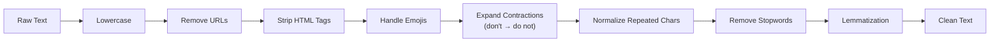
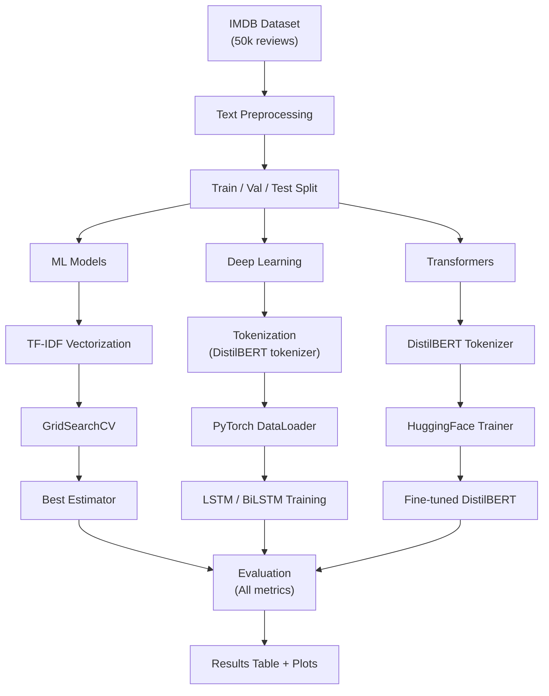

<div align="center">

# Sentiment Analysis — Multi-Model Comparison

**Compare 6 models — from Logistic Regression to DistilBERT — on the IMDB movie review dataset.**

This project delivers a complete sentiment analysis pipeline with thorough text preprocessing, exploratory data analysis, hyperparameter tuning, and error analysis. Train, evaluate, and deploy multiple models to understand how different approaches handle the same classification task.

[](https://python.org)
[](https://pytorch.org)
[](https://huggingface.co/docs/transformers)
[](https://scikit-learn.org)
[](https://flask.palletsprojects.com)
[](LICENSE)

</div>

---

## Overview

Sentiment analysis is a fundamental NLP task — determining whether a piece of text expresses a positive or negative opinion. This project moves beyond a single LSTM implementation to provide a **rigorous, side-by-side comparison** of six models on the IMDB dataset (50,000 labeled movie reviews).

| What | Why |
## Features

### Text Preprocessing Pipeline

Every review passes through a 9-stage cleaning process before reaching any model:



### Evaluation Metrics

| Metric | Description |
|--------|-------------|
| **Accuracy** | Overall correctness |
| **Precision** | How many positive predictions were right |
| **Recall** | How many actual positives were found |
| **F1-Score** | Harmonic mean of precision and recall |
| **ROC-AUC** | Trade-off between TPR and FPR |
| **Confusion Matrix** | Full breakdown of predictions |
| **Classification Report** | Per-class metrics |

### Exploratory Data Analysis

- Class distribution (balanced 25k / 25k)
- Review length distribution by sentiment
- Most frequent positive and negative words
- Word clouds for each class
- Bigram and trigram frequency analysis

### Error Analysis

After evaluation, the project analyzes:
- **False Positives** — reviews predicted positive but actually negative
- **False Negatives** — reviews predicted negative but actually positive
- **Root cause patterns** — short reviews, sarcasm, negation, mixed sentiment

### Hyperparameter Tuning

| Model | Search Strategy | Search Space |
|-------|----------------|--------------|
| Logistic Regression | GridSearchCV (3-fold) | C [0.1, 1, 10], max_features [3k, 5k, 10k] |
| Naive Bayes | GridSearchCV (3-fold) | alpha [0.01, 0.1, 0.5, 1.0], ngram_range [(1,1), (1,2)] |
| SVM | GridSearchCV (3-fold) | C [0.01, 0.1, 1, 10], loss [squared_hinge, hinge] |
| LSTM / BiLSTM | Config-driven | learning_rate, num_layers, dropout, embedding_dim |
| DistilBERT | HuggingFace Trainer | Epochs, batch size, eval strategy |

---

## Project Structure

```
├── config.py                  # Config, random seeds, hyperparameters
├── train.py                   # Train any or all models
├── evaluate.py                # Metrics, confusion matrix, ROC curves
├── predict.py                 # Single text prediction (CLI)
├── batch_predict.py           # CSV batch prediction
├── app.py                     # Flask API
├── requirements.txt           # Reproducible dependencies
│
├── utils/
│   ├── preprocessing.py       # 9-stage text cleaning pipeline
│   └── helpers.py             # Metrics, plots, results tables
│
├── models/
│   ├── ml_models.py           # LogReg, NaiveBayes, SVM + GridSearchCV
│   ├── lstm_model.py          # LSTM and BiLSTM (PyTorch)
│   └── distilbert_model.py    # DistilBERT fine-tuning
│
├── data/
│   └── dataset.py             # IMDB loading, tokenization, dataloaders
│
├── analysis/
│   ├── eda.py                 # Class dist, word clouds, n-grams
│   └── error_analysis.py      # FP/FN analysis, root cause patterns
│
└── results/                   # Generated outputs
    ├── eda/                   # EDA plots
    ├── error_analysis/        # Misclassification analysis
    ├── cm_*.png               # Confusion matrices per model
    ├── roc_*.png              # ROC curves per model
    └── model_comparison.csv   # All metrics in one table
```

---

## Quick Start

### Prerequisites

- Python 3.8+
- pip

### Installation

```bash
git clone https://github.com/YOUR_USERNAME/sentiment-analysis.git
cd sentiment-analysis

pip install -r requirements.txt
```

### Train All Models

```bash
python train.py
```

This trains all 6 models sequentially and saves a comparison table to `results/model_comparison.csv`.

Output example:

```
============================================================
MODEL COMPARISON RESULTS
============================================================
                     accuracy  precision  recall  f1_score  roc_auc
Logistic Regression    0.8845     0.8902   0.8776    0.8839   0.9521
Naive Bayes            0.8612     0.8661   0.8548    0.8604   0.9410
SVM                    0.8810     0.8858   0.8752    0.8805   0.9488
LSTM                   0.8720     0.8745   0.8698    0.8721      N/A
BiLSTM                 0.8785     0.8802   0.8762    0.8782      N/A
DistilBERT             0.9260     0.9281   0.9245    0.9263   0.9765
```

### Selective Training

```bash
python train.py --models logistic_regression svm lstm
python train.py --no-ml              # Skip ML models
python train.py --no-deep            # Skip deep learning
python train.py --no-distilbert      # Skip DistilBERT
```

---

## Usage

### Single Prediction

```bash
python predict.py \
    --text "This movie was absolutely incredible!" \
    --model-path models/saved/best_model.pkl \
    --model-type logistic_regression
```

### Batch Prediction (CSV)

```bash
python batch_predict.py \
    --input reviews.csv \
    --output predictions.csv \
    --text-column review
```

Input CSV:
```csv
review
"Amazing film, loved every minute."
"Terrible acting and boring plot."
...
```

Output CSV:
```csv
review,sentiment,confidence
"Amazing film, loved every minute.",Positive,0.9876
"Terrible acting and boring plot.",Negative,0.0023
...
```

### Flask API

```bash
python app.py
```

```bash
curl -X POST http://localhost:5000/predict \
  -H "Content-Type: application/json" \
  -d '{"text": "One of the best movies I have ever seen!"}'
```

Response:
```json
{
  "sentiment": "Positive",
  "confidence": 0.9834,
  "text": "One of the best movies I have ever seen!"
}
```

---

## Analysis Workflows

### Exploratory Data Analysis

```bash
python -m analysis.eda
```

Generates the following visualizations in `results/eda/`:

| Plot | What It Shows |
|------|---------------|
| `class_distribution.png` | Dataset is perfectly balanced (25k / 25k) |
| `review_length_distribution.png` | Positive reviews tend to be longer |
| `top_words_positive.png` | Frequent words in positive reviews |
| `top_words_negative.png` | Frequent words in negative reviews |
| `wordcloud_positive.png` | Word cloud for positive class |
| `wordcloud_negative.png` | Word cloud for negative class |
| `top_2grams_*.png` | Common bigrams per sentiment |
| `top_3grams_*.png` | Common trigrams per sentiment |

### Error Analysis

```bash
python -m analysis.error_analysis
```

Analyzes misclassifications to answer:
- Which reviews does the model get wrong?
- Are errors concentrated in short reviews?
- Does the model struggle with negation or sarcasm?
- What words are most common in false positives vs. false negatives?

---

## Reproducibility

This project is fully reproducible:

- **Random seeds**: Every randomness source is fixed (`SEED = 42` in `config.py`)
- **Deterministic PyTorch**: `torch.backends.cudnn.deterministic = True`
- **Dependencies pinned**: `requirements.txt` with exact version ranges
- **Dataset fixed**: IMDB from HuggingFace `datasets` — a standard, public benchmark

---

## How It Works

### Training Pipeline



---

## Tech Stack

| Layer | Technology |
|-------|-----------|
| **Language** | Python 3.8+ |
| **ML Models** | scikit-learn (LogReg, NB, SVM) |
| **Deep Learning** | PyTorch (LSTM, BiLSTM) |
| **Transformers** | HuggingFace Transformers (DistilBERT) |
| **Text Processing** | NLTK, BeautifulSoup, contractions |
| **Data Handling** | HuggingFace Datasets, Pandas |
| **Visualization** | Matplotlib, Seaborn, WordCloud |
| **API** | Flask |
| **Tuning** | GridSearchCV |

---

## Concepts Covered

- **Natural Language Processing**: Text classification, tokenization, vectorization
- **Traditional ML**: Logistic Regression, Naive Bayes, Support Vector Machines
- **Deep Learning**: RNNs, LSTMs, bidirectional architectures
- **Transformers**: DistilBERT, attention mechanisms, fine-tuning
- **Evaluation**: Metrics beyond accuracy, confusion matrix, ROC-AUC
- **MLOps**: Pipelines, GridSearch, model persistence, API serving
- **Data Science**: EDA, visualization, error analysis, reproducibility

---

## References

- [IMDB Dataset](https://huggingface.co/datasets/imdb) — 50,000 labeled movie reviews
- [DistilBERT Paper](https://arxiv.org/abs/1910.01108) — Sanh et al., 2019
- [HuggingFace Transformers](https://huggingface.co/docs/transformers)
- [scikit-learn GridSearchCV](https://scikit-learn.org/stable/modules/generated/sklearn.model_selection.GridSearchCV.html)
- [PyTorch LSTM](https://pytorch.org/docs/stable/generated/torch.nn.LSTM.html)

---

## License

This project is licensed under the MIT License. See the [LICENSE](LICENSE) file for details.

Copyright (c) 2026 Maddipatla Chetan

<div align="center">
<sub>Built with Python, PyTorch, HuggingFace Transformers, scikit-learn, and Flask.</sub>
</div>

