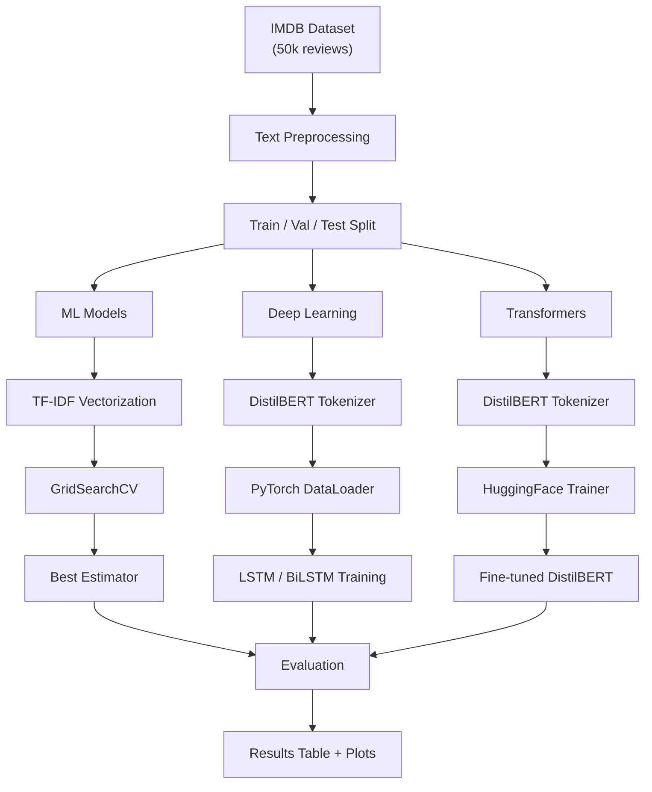

# Architecture

## Training Pipeline

## Text Preprocessing

Each review passes through 9 stages before reaching any model:

## Model Architectures

### Logistic Regression
- TF-IDF vectorization (unigrams + bigrams, max 5000 features)
- L2 regularization with C tuned via GridSearch

### Naive Bayes (Multinomial)
- TF-IDF vectorization
- Additive smoothing (alpha) tuned via GridSearch

### SVM (Linear)
- TF-IDF vectorization
- Hinge / squared hinge loss with C tuned via GridSearch

### LSTM
- Embedding layer (100 dim) → 2-layer LSTM (256 hidden) → Dropout (0.3) → FC (1)
- BCEWithLogitsLoss, Adam optimizer

### BiLSTM
- Same as LSTM but bidirectional (concatenates forward + backward hidden states)

### DistilBERT
- `distilbert-base-uncased` with classification head
- Fine-tuned for 3 epochs with HuggingFace Trainer
- Early stopping based on validation F1
